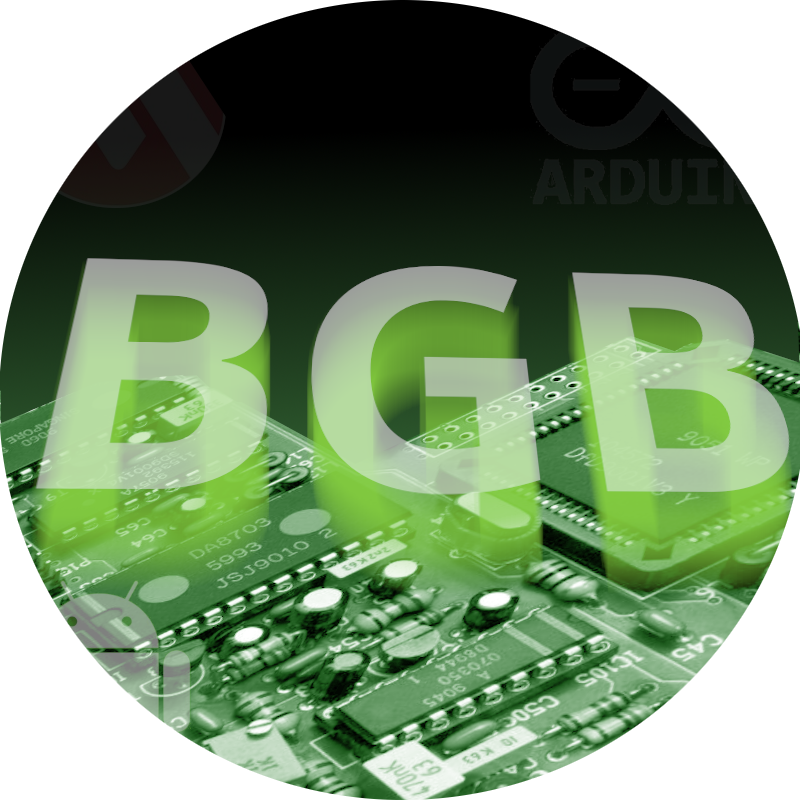
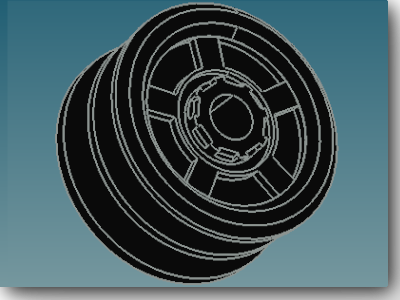
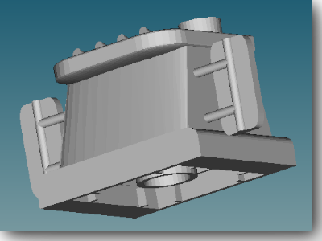
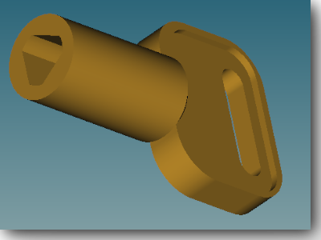
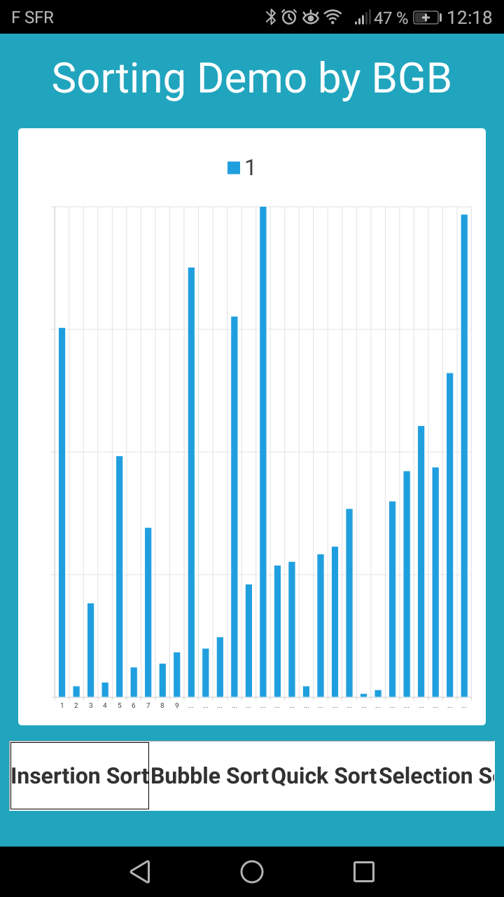
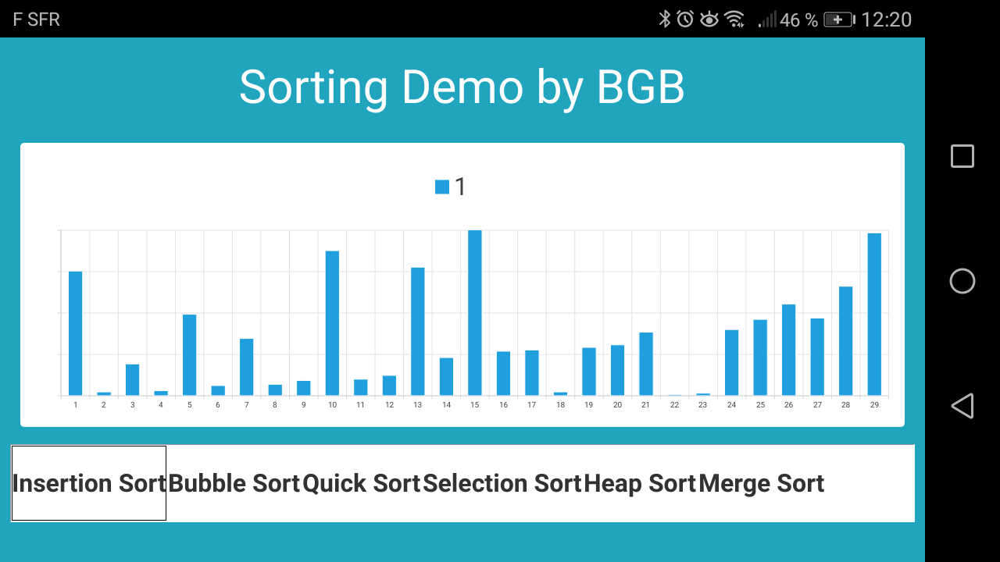
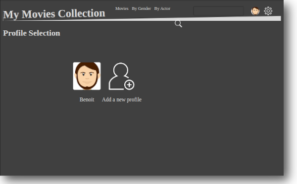

#  BGB - Extras
Extra electronics, software and C.A.D projects. You can see some examples hereunder.

## Extra Computer Aided Design

Some spare parts are available :  

	
	<h4>Mecano C876 (custom)</h4>
	Wheel for Mecano, made by using revolution approach.

---

	
	<h4>Mater Head by Mega Blocks</h4>
	Made under "Blender" using "Bevel" function.

---

	
	<h4>CAME key</h4>
	Can be useful in case of power cut. Made of 2 bodies.

## Extra Softwares

Training projects in many languages, including projects made during personal
["OpenClassRoom"](https://openclassrooms.com/) lessons.

<h4>Sorting Demo</h4>

A <strong>Qt</strong> CrossCompile project for <strong>Android </strong>.
Using  <strong>QCharts</strong> and  <strong>QThread </strong> to show up sorting algorithm process.
This project refers to strategy patterns for sorting methods (Sorting Strategy).

---

<h4>BGB-Filmothek</h4>
A <strong>Angular</strong> Project made for <a hrfe="https://openclassrooms.com/fr/courses/4668271-developpez-des-applications-web-avec-angulardeveloppez-des-applications-web-avec-angular">
"Développez des applications Web avec Angular" </a> an OpenClassRoom lesson.

## Extra Electronics

Little electronics projects for railway scales models or whatever stuff which can be useful.

	
	<h4>Dcc NEM652 Socket</h4>
	This is an 8-pin socket connector standard for DCC decoder.

